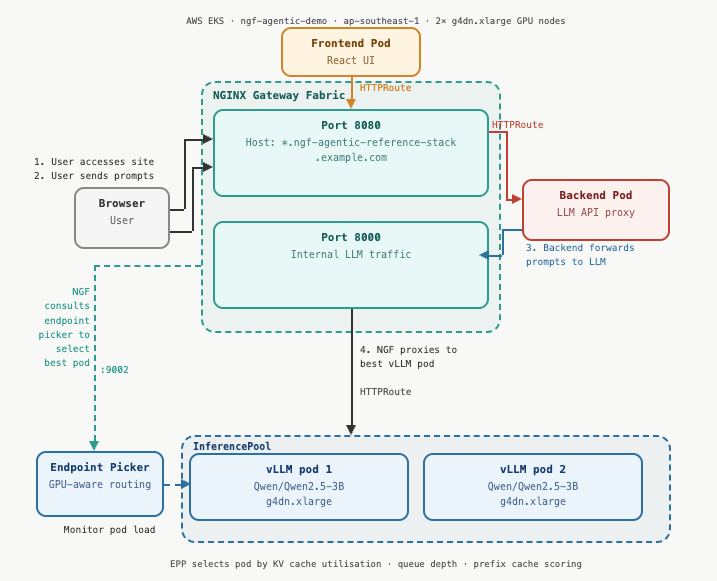

# NGF Agentic Reference Stack — AWS EKS

## Overview
This demo runs NGINX Gateway Fabric (NGF) with the Gateway API Inference Extension,
routing traffic to vLLM serving an LLM model on GPU nodes. 

The whole setup runs in AWS, with company SSO login. Deployment scripts and testing scripts are run from local Mac.

> This demo is loosely based on the idea from [leonseng/ngf-agentic-reference-stack](https://github.com/leonseng/ngf-agentic-reference-stack/blob/main/docs/deployment.md).

**Traffic flow:**



The EPP intelligently routes each request to the optimal vLLM pod based on
real-time metrics: queue depth, KV cache utilization, and prefix cache hits.

## Prerequisites
- AWS CLI v2 installed and configured with SSO
- kubectl installed
- helm installed
- A Hugging Face account with access token

## AWS Setup

### Configure AWS SSO
If you haven't set up AWS SSO yet, run:
```bash
aws configure sso
```

You will be prompted for:
- SSO start URL: provided by your AWS admin
- SSO region: your AWS region (e.g. `ap-southeast-1`)
- Account ID: your AWS account ID
- Role name: your SSO role name

This creates a profile in `~/.aws/config` like:
```ini
[profile <YOUR_PROFILE_NAME>]
sso_session = <YOUR_SSO_SESSION>
sso_account_id = <YOUR_ACCOUNT_ID>
sso_role_name = <YOUR_ROLE_NAME>
region = <YOUR_REGION>
```

### Login and configure kubectl
```bash
aws sso login --sso-session <YOUR_SSO_SESSION>
export AWS_PROFILE=<YOUR_PROFILE_NAME>
aws eks update-kubeconfig --region <YOUR_REGION> --name <YOUR_CLUSTER_NAME>
```

## VPC Prerequisites

> Skip this section if you are using an existing VPC that is already set up correctly.

The EKS cluster requires a VPC with the following setup:

**Subnets:**
- At least 2 **public subnets** (one per AZ) — used for the NAT Gateway and Load Balancer
- At least 2 **private subnets** (one per AZ) — used for EKS node groups

**NAT Gateway:**
- Required so that nodes in private subnets can reach the internet for:
  - Pulling container images from Docker Hub (vLLM, NGF, etc.)
  - Downloading the LLM model from Hugging Face
  - Installing packages and Helm charts
- Deploy the NAT Gateway in a public subnet and add a route in the private subnet route table pointing `0.0.0.0/0` to the NAT Gateway

**Security Group:**
- EKS automatically creates and manages the cluster security group
- Ensure the cluster security group allows inbound port `443` from within the VPC so nodes can reach the EKS API server
- The Load Balancer security group is also managed automatically by EKS when the NGF service of type `LoadBalancer` is created

## Phase 1 — Create EKS Cluster via AWS Console

> Skip this section if the cluster already exists.

### 1. Create the cluster
- Go to EKS → Create cluster → **Custom configuration** (not Quick)
- Name: `<YOUR_CLUSTER_NAME>`
- Kubernetes version: `1.33`
- Cluster IAM role: `AmazonEKSClusterRole`
- Networking: select your VPC, select all subnets, endpoint access: Public
- Add-ons: keep only `CoreDNS`, `Amazon VPC CNI`, `Amazon EKS Pod Identity Agent`
- **Do NOT enable EKS Auto Mode**

### 2. Add CPU node group (Compute tab → Add node group)
- Name: `cpu-workers`
- AMI: `Amazon Linux 2023 (AL2023_x86_64_STANDARD)`
- Instance: `t3.medium`, Disk: `20 GB`
- Desired/Min/Max: `1/1/2`
- Subnets: **private subnets only**

### 3. Add GPU node group
- Name: `gpu-workers`
- AMI: `Amazon Linux 2023 NVIDIA (AL2023_x86_64_NVIDIA)`
- Instance: `g4dn.xlarge`, Disk: `100 GB` ← important, default 20GB is too small
- Desired/Min/Max: `2/2/2`
- Subnets: **private subnets only**

### 4. Install kube-proxy addon ← critical, do not skip
Without this, CoreDNS fails and nothing works.
```bash
aws eks create-addon \
  --cluster-name <YOUR_CLUSTER_NAME> \
  --addon-name kube-proxy \
  --region <YOUR_REGION> --no-cli-pager
```

### 5. Grant SSO role access (Access tab → Create access entry)
- Principal ARN: `arn:aws:iam::<YOUR_ACCOUNT_ID>:role/aws-reserved/sso.amazonaws.com/<YOUR_SSO_ROLE_NAME>`
- Policy: `AmazonEKSClusterAdminPolicy`, Scope: Cluster

## Phase 2 — Deploy everything

```bash
# Verify all 3 nodes are Ready
kubectl get nodes

# Deploy everything (replace with your actual HF token)
bash deploy.sh hf_xxxxxxxxxxxxxxxxxxxxxxxxxxxx
```

`deploy.sh` handles everything automatically:
- Installs NVIDIA device plugin
- Labels GPU nodes correctly
- Installs Gateway API CRDs, Inference Extension CRDs, NGF
- Creates namespaces and HF token secret
- Deploys frontend, backend, vLLM, EPP

## Accessing the demo

The simplest approach is to use a Linux EC2 with desktop (Ubuntu + xrdp) in the same VPC.
This avoids needing to modify your local `/etc/hosts`.

### Set up demo desktop EC2
- Launch Ubuntu 24.04 EC2, `t3.medium`, in a public subnet of your VPC
- SSH in and run:
```bash
sudo apt update && sudo apt upgrade -y
sudo apt install -y ubuntu-desktop-minimal xrdp
sudo systemctl enable xrdp
sudo passwd ubuntu
sudo reboot
```
- Add RDP port 3389 to the EC2 security group
- Connect via Microsoft Remote Desktop (username: `ubuntu`)

### Configure hosts file on demo desktop
```bash
# Get LB IP
nslookup <YOUR_LB_HOSTNAME> | grep "Address:" | tail -1

# Add to /etc/hosts
sudo nano /etc/hosts
# Add: <LB_IP> frontend.ngf-agentic-reference-stack.example.com
# Add: <LB_IP> backend.ngf-agentic-reference-stack.example.com
```

### Access the UI
- Open Firefox and go to `http://frontend.ngf-agentic-reference-stack.example.com:8080`
- Set the API URL field to `http://backend.ngf-agentic-reference-stack.example.com:8080`

## Testing EPP load-aware routing

This section demonstrates that the EPP routes requests intelligently based on
real-time GPU metrics — not round-robin.

### Install watch (Mac only)
```bash
brew install watch
```

### Get current vLLM pod names and IPs
```bash
kubectl get pods -n vllm -o wide
```
Note the pod names and IPs for the two `vllm-model-xxx` pods (not the epp pod).

### Open two terminals

**Terminal 1 — Monitor GPU metrics on both pods**

Replace `<POD_1_NAME>`, `<POD_2_NAME>`, `<POD_1_IP>`, `<POD_2_IP>` with values from above:

```bash
watch -n2 "echo '--- Pod 1 (<POD_1_IP>) ---' && \
  kubectl -n vllm exec <POD_1_NAME> -- curl -s localhost:8000/metrics 2>/dev/null | \
  grep -E 'gpu_cache_usage_perc|num_requests_running|num_requests_waiting' && \
  echo '--- Pod 2 (<POD_2_IP>) ---' && \
  kubectl -n vllm exec <POD_2_NAME> -- curl -s localhost:8000/metrics 2>/dev/null | \
  grep -E 'gpu_cache_usage_perc|num_requests_running|num_requests_waiting'"
```

**Terminal 2 — Generate concurrent load**

Get the LB hostname first:
```bash
kubectl -n nginx-gateway get service inference-gateway-nginx -o jsonpath='{.status.loadBalancer.ingress[0].hostname}'
```

Then send concurrent requests with **varied prompts** (replace `<LB_HOSTNAME>` with the output above):

> Important: Use different prompts for each request. The EPP includes a prefix-cache-scorer — repeated identical prompts will always route to the same pod because that pod has the prompt cached, making it look more attractive. Varied prompts give all pods equal cache scores, allowing the EPP to distribute based on queue depth and KV cache utilization.

```bash
prompts=(
  "Explain the history of ancient Rome in detail"
  "Write a detailed analysis of climate change impacts"
  "Describe how quantum computers work"
  "Explain the French Revolution and its causes"
  "Write about the biology of deep sea creatures"
  "Describe the economic impacts of the industrial revolution"
  "Explain how neural networks learn"
  "Write about the history of the silk road"
  "Describe how black holes form"
  "Explain the causes of World War 1"
)

for i in {0..9}; do
  curl -s -H "Host: backend.ngf-agentic-reference-stack.example.com" \
    http://<LB_HOSTNAME>:8080/v1/chat/completions \
    -H "Content-Type: application/json" \
    -d "{\"model\":\"Qwen/Qwen2.5-3B-Instruct\",\"messages\":[{\"role\":\"user\",\"content\":\"${prompts[$i]}\"}]}" &
done
wait
```

### What to observe
- Terminal 1: `num_requests_running` increases on both pods as load is distributed
- Terminal 1: `gpu_cache_usage_perc` rises as KV cache fills up
- NGF logs show EPP routing decisions in real time:
```bash
kubectl -n nginx-gateway logs deployment/inference-gateway-nginx -c nginx -f | grep EndpointPicker
```
You should see: `js: found inference endpoint from EndpointPicker: 10.0.x.x:8000`

The EPP switches between pods based on who has lower queue depth and KV cache usage — not naive round-robin.

## Cost management — scale down GPU nodes when not in use

GPU nodes are costly. Scale them down overnight/weekends.

### Scale down
```bash
aws eks update-nodegroup-config \
  --cluster-name <YOUR_CLUSTER_NAME> \
  --nodegroup-name gpu-workers \
  --scaling-config minSize=0,maxSize=2,desiredSize=0 \
  --region <YOUR_REGION> --no-cli-pager
```

Check status — when it shows `"ACTIVE"` the scale down is complete:
```bash
aws eks describe-nodegroup \
  --cluster-name <YOUR_CLUSTER_NAME> \
  --nodegroup-name gpu-workers \
  --query "nodegroup.status" \
  --region <YOUR_REGION> --no-cli-pager
```

Everything else (NGF, frontend, backend, EPP) keeps running on the CPU node unaffected.

### Scale back up

- Login to AWS:
```bash
aws sso login --sso-session <YOUR_SSO_SESSION>
export AWS_PROFILE=<YOUR_PROFILE_NAME>
aws eks update-kubeconfig --region <YOUR_REGION> --name <YOUR_CLUSTER_NAME>
```

- Scale GPU nodes back up:
```bash
aws eks update-nodegroup-config \
  --cluster-name <YOUR_CLUSTER_NAME> \
  --nodegroup-name gpu-workers \
  --scaling-config minSize=2,maxSize=2,desiredSize=2 \
  --region <YOUR_REGION> --no-cli-pager
```

- Wait for nodes to be ready (~5 mins):
```bash
kubectl get nodes -w
```
Wait until both `g4dn.xlarge` nodes show `Ready`.

- Relabel the new GPU nodes:
```bash
kubectl get nodes -l node.kubernetes.io/instance-type=g4dn.xlarge -o name | while read node; do
  kubectl label $node feature.node.kubernetes.io/pci-10de.present=true --overwrite
  kubectl label $node role=gpu --overwrite
done
```

- Restart EPP (important — clears stale pod state from before scale down):
```bash
kubectl rollout restart deployment/vllm-model-epp -n vllm
```

- Restart vLLM pods (they were Pending while nodes were gone):
```bash
kubectl rollout restart deployment/vllm-model -n vllm
kubectl get pods -n vllm -w
```
Wait ~5 mins for vLLM to load the model. The demo is ready when both vLLM pods show `1/1 Running`.

## Teardown

```bash
kubectl delete namespace frontend backend vllm
kubectl -n nginx-gateway delete -f inference-gateway/gateway.yaml
# Then delete node groups and cluster via AWS Console
```
